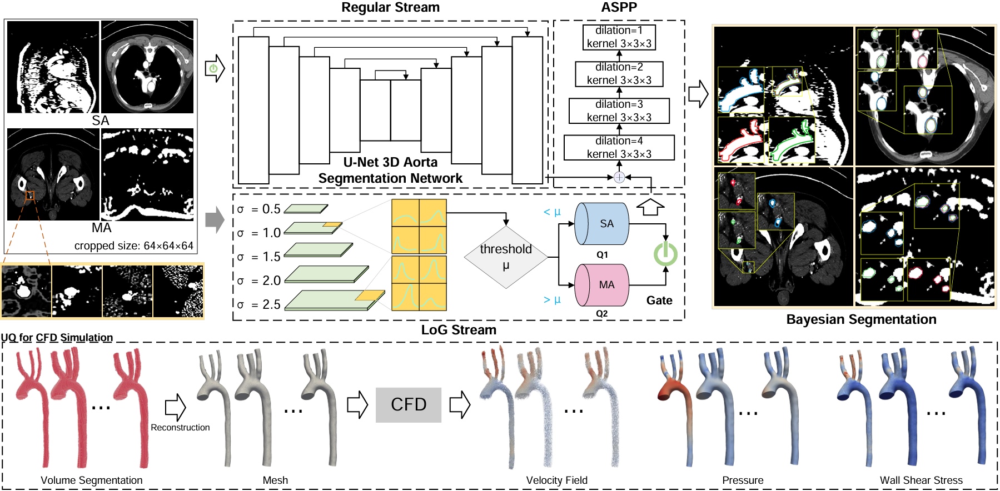
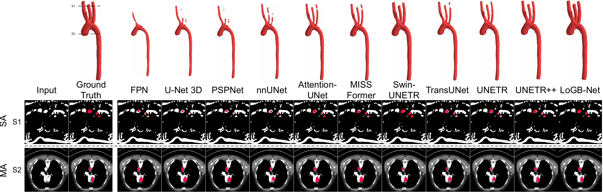

# Hierarchical LoG Bayesian Neural Network for Enhanced Aorta Segmentation

[Delin An](https://github.com/adlsn)<sup>1</sup>, Pan Du<sup>1</sup>, [Pengfei Gu](https://pgu-nd.github.io/)<sup>2</sup>, [Jian-Xun Wang](https://www.engineering.cornell.edu/faculty-directory/jian-xun-wang)<sup>3</sup>, and [Chaoli Wang](https://sites.nd.edu/chaoli-wang/)<sup>1</sup>

University of Notre Dame<sup>1</sup>, The University of Texas Rio Grande Valley<sup>2</sup>, Cornell University<sup>3</sup>

<div>
  
</div>

## Introduction

> This repository contains the implementation of **Hierarchical LoG Bayesian Neural Network (LoGB-Net)** for enhanced 3D aorta segmentation. The framework integrates Bayesian principles with a hierarchical Laplacian of Gaussian (LoG) module to achieve high geometric fidelity and multiscale blood vessel recognition, particularly for small-radius vessels. 

> ### Key Features:
> - A **Bayesian LoG module** for uncertainty quantification and robust feature extraction.
> - A **UNet-inspired 3D architecture** with multiscale encoder-decoder pathways.
> - **ASPP refinement** for capturing multiscale contextual information.

> This method suits medical imaging tasks requiring accurate segmentation with geometric preservation, such as aortic dissection analysis and computational fluid dynamics (CFD) simulation preparation.

---

## Experiments

> We evaluate our method on the following dataset, with comparisons against baseline approaches.

> ### Dataset
> - [VMR Aorta data](https://www.vascularmodel.org/)
> - [AVT data](https://figshare.com/articles/dataset/Aortic_Vessel_Tree_AVT_CTA_Datasets_and_Segmentations/14806362)

> ### Qualitative Evaluation**:
>   - Achieved superior Dice scores compared to state-of-the-art methods.
>   - Demonstrated robustness in detecting small vessels.
  
<div>
  
</div>

---


## Installation, Train, and Test
The code is developed by Python. After cloning the repository, follow the steps below for installation:
1. Create and activate the conda environment
```python
conda create --name logb python=3.11
conda activate logb
```
2. Install dependencies
```python
pip install -r requirements.txt
```
3. Train
```python
python train.py
```

4. Test
```python
python test.py
```

## Dependencies
* Python (3.11), other versions should also work
* PyTorch (2.3.0), other versions should also work

## Contact
Should you have any questions, please send emails to dan3@nd.edu.


